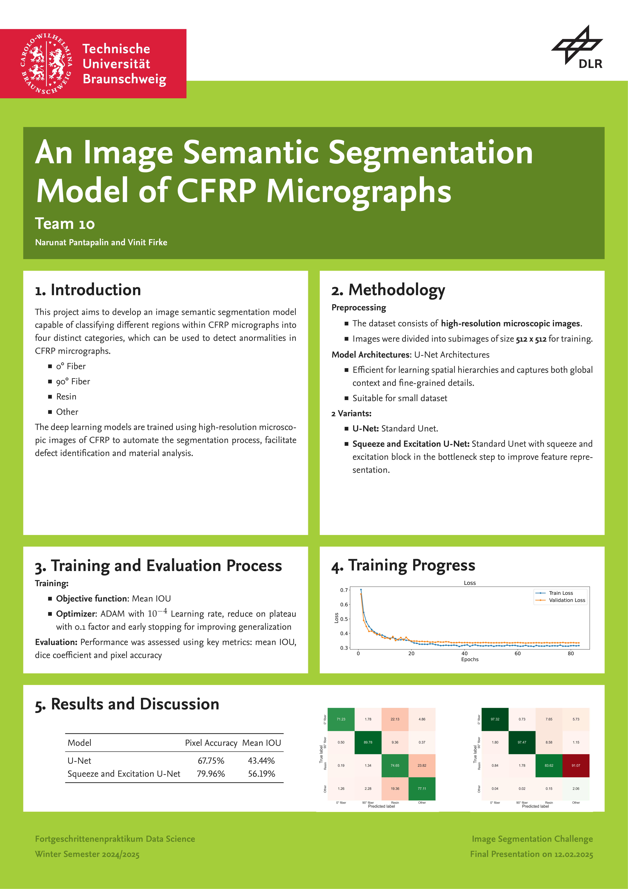

# Fortgeschrittenepraktikum_DataScience

This project contains a DLR (Deutsche Luft und Raumfahrt) project for image segmentation and detection of anamolies like 0 degre, 90 degree fibers, Resin and the rest. Fiji toolkit was used for image segementation and this trained model was used to detect the anamolies using the U-Net architecture - an encoder-decoder based neural network. 

The high resolution microscopic images were divided into 40x40 coloured and masked images on which our U-Net was trained. The trained model was then sent to the professor who conducted this course to test on unseen data, the results of which are provided in the poster below.

IMPORTANT NOTE: This is a joint project of Vinit Firke (myself) and Narunat Pantapalin (https://github.com/narupanta) for the Fortgeschrittene Praktikum Data Science course happened in Winter Semester 2024-25 at TU Braunschweig.

